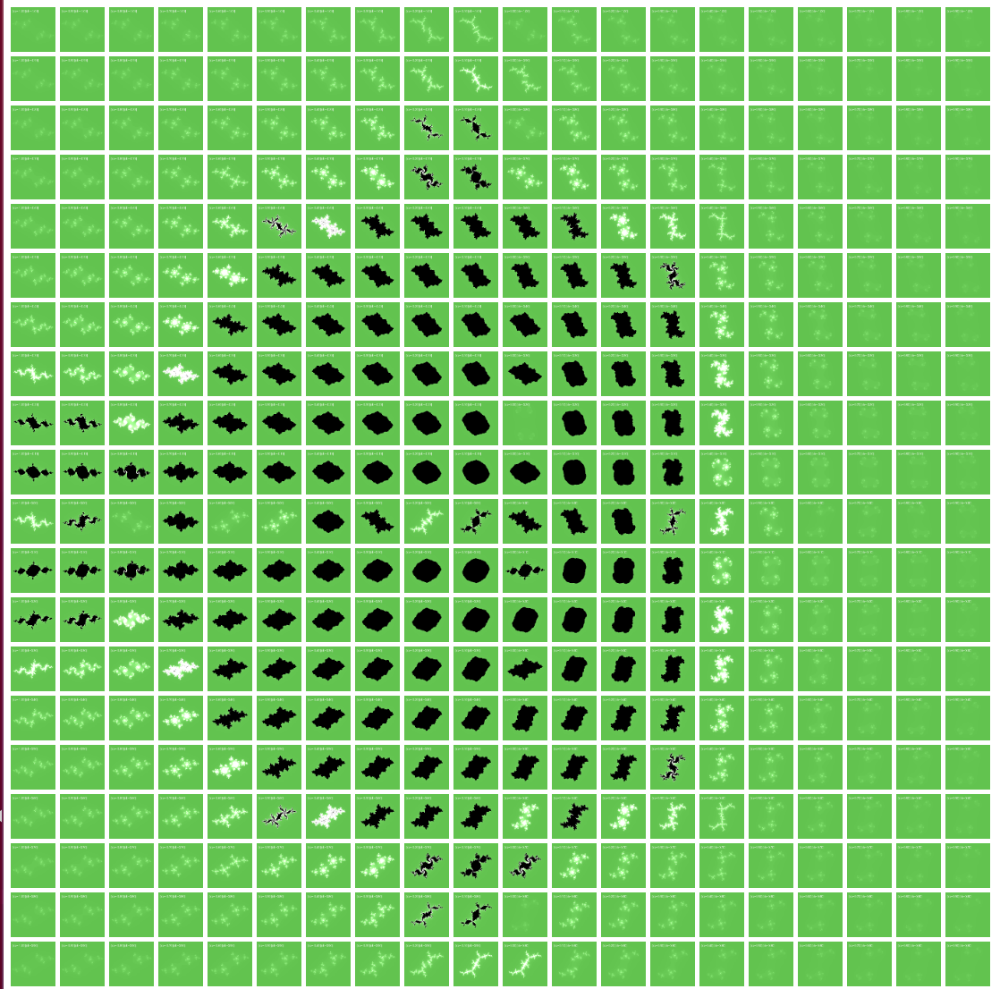

# JuliaArt Grid

This is a JuliaSet grid generated with version 0.0.13 of [juliart](https://www.github.com/vsoch/juliart).
I wanted to understand how varying the parameter space (the a and b components of the parameter c)
would influence the resulting image, so I created this small repository.

You can also see an animation looping through the images (the order might not be perfect):

And you can see the full, interactive version on [GitHub pages](https://vsoch.github.io/juliart-grid).
The beautiful thing is that (I think) we can see that Julia Sets form indices of a larger
Mandelbrot set! Awesome.
